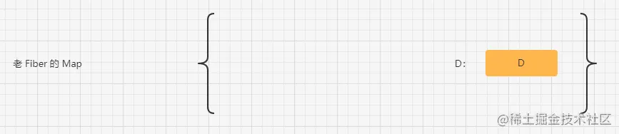
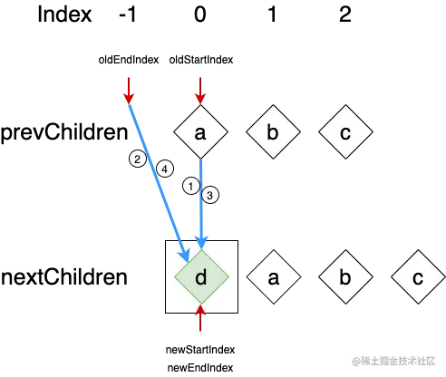

## React、Vue2、Vue3的Diff算法对比
### [React](https://juejin.cn/post/7116141318853623839#heading-9)
> 在组件状态数据发生变更的时候，根据最新的状态数据先生成新的虚拟DOM，再去构建一棵新的workInProgress Fiber树，而在重新协调构建新的Fiber树的过程也就是React Diff发生的地方。

1. 从左到右循环新列表和旧列表进行对比，如果节点可以匹配则复用老fiber的节点信息(标记为Update)，无需进行位置移动，存储老fiber节点的位置信息(游标位置)，用于后续判断位置是否需要移动。
    - 如果新列表循环完，旧列表还有剩余节点表示剩余节点应该被删除(标识Deletion)。
    - 如果旧列表循环完，新列表还有剩余节点表示剩余节点应该被新建(标识Placement)。
2. 当第一步循环遇到新旧列表对比不匹配的情况时，第一轮循环对比结束，进行第二轮对比。
    - 将剩下未对比的老fiber节点全部存储在一个老fiber的key或老fiber的index为key，fiber节点为value的Map中。
    - 循环新列表第一轮对比后剩余未对比成功的节点，从老fiber节点的Map中寻找可以匹配成功的节点。
        1. 从老fiber节点的Map找到可以匹配成功的节点时，暂存老fiber节点，将匹配成功的老fiber节点从Map中删除，再进行老fiber节点的信息复用。将匹配成功的老fiber节点的位置和之前存储游标位置进行比较。
            - 如果大于或等于之前的游标位置，表示无需进行位置移动(标识为Update)，将游标位置更新为当前匹配成功的老fiber节点的位置信息。
            - 如果小于之前的游标位置，表示需要进行位置移动(标识为Placement)，游标位置无需更新。
            - 匹配到的老fiber节点如果和新节点位置相同或者在新节点位置的右边则不需要进行位置移动。
         2. 从老fiber节点的Map未找到可以匹配成功的节点时，表示没有老fiber节点可以复用需要新建(标记为Placement)，游标位置无需更新。
    - 如果新列表循环完，老fiber节点的Map中还有剩余节点表示剩余节点应该被删除(标识Deletion)。

### [Vue2-双端对比](https://juejin.cn/post/6919376064833667080#heading-8)
> 新列表和旧列表两个列表的头与尾互相对比，在对比的过程中指针会逐渐向内靠拢。当头尾对比失败时遍历新列表去旧列表中找可匹配的节点。当其中一个列表的节点全部遍历完成时查看另一个列表是否存在数据进行删除或添加操作即可。

1. 新列表和旧列表两个列表的头与尾互相对比，寻找可匹配的节点。
    - 使用旧列表的头一个节点oldStartNode与新列表的头一个节点newStartNode对比。
    - 使用旧列表的最后一个节点oldEndNode与新列表的最后一个节点newEndNode对比。
    - 使用旧列表的头一个节点oldStartNode与新列表的最后一个节点newEndNode对比。
    - 使用旧列表的最后一个节点oldEndNode与新列表的头一个节点newStartNode对比。
2. 当对比时找到了可匹配的节点时先给元素打补丁，然后将指针进行前/后移一位继续进行头与尾互相对比。根据对比节点的不同移动的指针和方向也不同，移动指针和方向如下：
    - 当旧列表的头一个节点oldStartNode与新列表的头一个节点newStartNode可匹配时，那么旧列表的头指针oldStartIndex与新列表的头指针newStartIndex同时向后移动一位。
    - 当旧列表的最后一个节点oldEndNode与新列表的最后一个节点newEndNode可匹配时，那么旧列表的尾指针oldEndIndex与新列表的尾指针newEndIndex同时向前移动一位。
    - 当旧列表的头一个节点oldStartNode与新列表的最后一个节点newEndNode可匹配时，那么旧列表的头指针oldStartIndex向后移动一位；新列表的尾指针newEndIndex向前移动一位。
    - 当旧列表的最后一个节点oldEndNode与新列表的头一个节点newStartNode可匹配时，那么旧列表的尾指针oldEndIndex向前移动一位；新列表的头指针newStartIndex向后移动一位。
3. 通过循环让指针向内靠拢，循环停止的条件是当其中一个列表的节点全部遍历完成。
4. 头尾节点对比到可匹配节点时的移动(理想状态下)
    - 旧列表的头节点oldStartNode和新列表的头节点newStartNode可匹配时，原本在旧列表中就是头节点在新列表中也是头节点，该节点不需要移动。
    - 旧列表的尾节点oldEndNode和新列表的尾节点newEndNode可匹配时，原本在旧列表中就是尾节点在新列表中也是尾节点，该节点不需要移动。
    - 旧列表的头节点oldStartNode和新列表的尾节点newEndNode可匹配时，原本在旧列表头部的节点却是新列表中的末尾节点，只需要把当前的节点移动到原本旧列表中的最后一个节点之后，让它成为最后一个节点即可。
    - 旧列表的尾节点oldEndNode与新列表的头节点newStartNode可匹配时，原本在旧列表末尾的节点却是新列表中的开头节点，只需要把当前的节点移动到原本旧列表中的第一个节点之前，让它成为第一个节点即可。
5. 头尾节点对比没有找到可匹配的节点时(非理想状态下)，当头与尾四次对比都没找到匹配节点时，拿新列表的第一个节点去旧列表中寻找可匹配的节点。
    - 如果在旧列表中找到可匹配的节点，只需要将找到的虚拟节点的DOM元素移动到开头。DOM移动后需要将旧列表中的节点改为undefined，标识已经做了节点的移动后续不需要进行再次的对比，旧列表遍历到undefind时就跳过当前节点。然后将头指针newStartIndex向后移一位。
    - 如果在旧列表中没有找到可匹配的节点，直接创建一个新的节点放到最前面，然后将头指针newStartIndex向后移一位。
6. 添加节点：当旧列表的oldEndIndex小于oldStartIndex时，如果新列表中还有剩余的节点，需要将剩余的节点依次插入到oldStartNode的DOM之前。因为剩余的节点在新列表的位置是位于oldStartNode之前的，如果剩余节点是在oldStartNode之后，oldStartNode就会先行对比。

7. 移除节点：当新列表的newEndIndex小于newStartIndex时，将旧列表剩余的节点删除即可。需要注意旧列表的undefind，遇到跳过当前循环即可。
### [Vue3-最长递增子序列](https://juejin.cn/post/7045976871116210213)
> 新旧列表的头和头对比、尾与尾对比，指针从两端向内靠拢。通过最长递增子序列减少DOM的移动次数。

1. 前置与后置的预处理
    - 从左往右进行对比，如果新旧列表的节点可匹配就进行更新对比，如果不匹配则停止对比，记录停止的下标。
    - 再从右往左进行对比，如果新旧列表的节点可匹配就进行更新对比，如果不匹配也停止对比，也记录停止的下标。
    - 通过这样左右进行对比，可以把真正复杂部分的范围锁定。
    - 左右对比完之后，如果新列表已经对比完了，旧列表还存在节点未对比，则删除旧列表上的未对比的节点；如果旧列表已经对比完了，新列表还存在未对比的节点则进行创建。
2. 当前置和后置的预处理结束后，新旧列表都还有剩余节点时进行更进一步的对比处理
    - 把剩下未对比的新节点处理成节点的key(或type)为key, 节点下标为value的Map。
    - 初始化一个长度为剩下未对比新节点的长度的数组newIndexToOldIndexMap，初始化每个数组的下标的默认值为-1。
    - 循环剩下未对比的旧节点，通过旧节点的key去刚刚创建的Map中查找是否有匹配的节点，如果旧节点没有key则需要通过循环剩下未对比的新节点进行匹配。
        1. 如果旧节点在新列表中不存在，直接删除即可。
        2. 使用变量记录已经匹配成功的节点，当该变量值和新列表剩余节点数量相同时，剩余旧节点直接删除即可。
        3. 如果新旧节点匹配成功，将newIndexToOldIndexMap中匹配成功的新节点的值更新为对应匹配成功的旧节点的下标。
    - 把剩下未对比的旧节点循环完会得到一个刚刚收集的新节点所对应旧节点的下标数组，对这个新节点所对应旧节点的下标数组进行最长递增子序列查找得到一个最长递增子序列的下标数据。
    - 从后循环剩下未对比的新节点(因为使用insertBefore是将元素插入到一个元素的前面所以从后开始循环)，通过循环的下标去newIndexToOldIndexMap查找对应的值
      1. 如果为-1表示没有在旧列表中匹配成功，需要新建。
      2. 如果在最长递增子序列中则不需要移动。
      3. 如果不在最长递增子序列中则需要对该节点进行移动操作，找到需要移动到的位置移动节点即可。
### React、Vue2、Vue3的Diff算法对比
- 相同点
    1. 都是忽略跨级比较，只做同级比较。
    2. 两个不同类型的元素会产生出不同的树，不会尝试复用。
    3. Diff对比都是优先处理简单的场景，再处理复杂的场景。
        - React是先处理左边部分，再进行复杂部分的处理。
        - Vue2是先进行首首、尾尾、首尾、尾首部分的处理，再进行中间复杂部分的处理。
        - Vue3是先处理首尾部分，再进行中间复杂部分的处理。
        - Vue2和Vue3最大的区别就是在处理中间复杂部分使用了最长递增子序列算法找出稳定序列的部分。
    4. 在处理老节点部分，都把节点处理成key-value的Map数据结构，方便在后续的比对中可以快速找到对应的节点。
    5. 在比对两个新老节点是否相同时，key是否相同是非常重要的判断标准。
    6. 在移动或者创建节点的时候都使用了insertBefore(newnode, existingnode)这个API。
- 不同点
    1. 对静态节点(template模板中没有使用v-bind绑定属性的标签)的处理不一样。
        - 由于Vue是通过template模版进行编译的，所以在编译的时候可以很好对静态节点进行分析然后进行打补丁标记。
        - 静态节点Diff的时候，Vue2判断如果是静态节点则跳过循环对比，而Vue3则是把整个静态节点进行提升处理，Diff的时候是不进入循环的，所以Vue3比Vue2的Diff性能更高效。
        - React是通过JSX进行编译的，是无法进行静态节点分析的，所以React在对静态节点处理这一块是要逊色的。
    2. Vue2和Vue3的比对和更新是同步进行的，跟React15是相同的，在比对的过程中如果发现了节点需要移动或者更新或删除是立即执行的，也就是React中常讲的不可中断的更新，如果比对量过大的话，就会造成卡顿。React16更改为了比对和更新是异步进行的，Diff是可以中断在内存中进行的。
    3. Vue2和Vue3都使用了双端对比算法，而React的Fiber由于是单向链表的结构，所以在React不设置由右向左的链表之前无法实现双端对比。
### A,B,C,D => D,A,B,C
- React是从左向右进行比对的，React需要把A,B,C三个节点分别移动到D节点的后面。
- Vue2在进行老节点的结尾与新节点的开始比对的时候发现这两个节点是相同的，把老节点结尾的D移动到新节点开头，剩下的就只进行老节点的开始与新节点的开始进行比对，发现它们的位置没有发生变化，不需要进行移动。
- Vue3没有Vue2的新老首尾节点进行比较，只是从两组节点的开头和结尾进行比较，然后往中间靠拢，Vue3在进行新老节点的开始和结尾比对的时候没有比对成功，接下来就进行中间部分的比较，使用最长递增子序列算法找出其中的稳定序列部分(A,B,C)，然再对新节点进行循环比对发现新节点的A,B,C都在稳定序列部分不需要进行移动，只对D进行移动即可。

