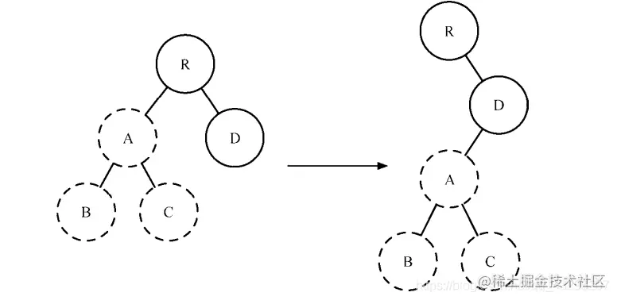
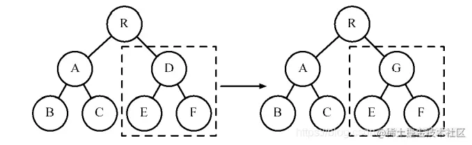
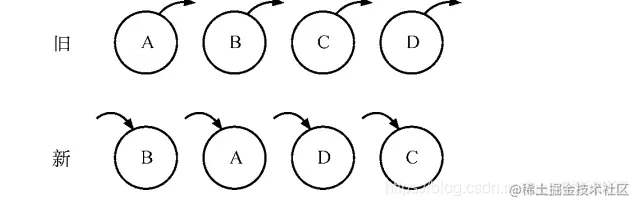

## react Diff(深度优先遍历)
- React在执行render过程中会产生新的虚拟DOM，在浏览器平台下为了尽量减少DOM的创建，React会对新旧虚拟DOM进行Diff算法找到它们之间的差异，尽量复用DOM从而提高性能。所以Diff算法主要就是用于查找新旧虚拟DOM之间的差异。
- Diff操作本身也会带来性能损耗，React文档中提到即使在最前沿的算法中，将前后两棵树完全比对的算法的复杂程度为O(n^3)，其中n是树中元素的数量。如果在React中使用了该算法，那么展示1000个元素所需要执行的计算量将在十亿的量级范围。这个开销实在是太过高昂无法接受。
### O(n^3) => O(n)
- 每个节点都要去和另一棵树的全部节点对比一次，这就是n了，如果找到有变化的节点，执行插入、删除、修改也是n的复杂度。所有的节点都是这样再乘以n，所以是O(n * n * n)的复杂度。
- 有了上述的限制这样只要遍历一遍，对比一下type就行了，是O(n)的复杂度，而且type变了就不再对比子节点。因为vdom中记录了关联的dom节点，执行dom的增删改也不需要遍历，是O(1)的，整体的Diff算法复杂度就是O(n)的复杂度。
### Diff算法是一种对比算法
> 对比两者是旧虚拟DOM和新虚拟DOM，对比出是哪个虚拟节点更改了，找出这个虚拟节点，并只更新这个虚拟节点所对应的真实节点，而不用更新其他数据没发生改变的节点，实现精准地更新真实DOM，进而提高效率。

- 使用虚拟DOM算法的损耗计算
> 总损耗 = 虚拟DOM增删改(与Diff算法效率有关) + 真实DOM差异增删改 + (较少的节点)排版与重绘

- 直接操作真实DOM的损耗计算
> 总损耗 = 真实DOM完全增删改 + (可能较多的节点)排版与重绘

### 降低算法复杂度，React的Diff会预设三个限制
1. 只对同级元素进行Diff，不做跨级比较。如果一个DOM节点在前后两次更新中跨越了层级，那么React不会尝试复用它，React只会简单地考虑同层级节点的位置变换，而对于不同层级的节点，只有创建和删除操作。(tree diff)
2. 两个不同类型的元素会产生出不同的树。如果元素由div变为p，React会销毁div及其子孙节点，并新建p及其子孙节点。(component diff)
3. 开发者可以通过key属性来告诉react哪些子元素在不同的渲染下能保持稳定。(element diff)
### tree diff
- tree diff主要针对的是React DOM节点跨层级的操作。由于跨层级的DOM移动操作较少，所以tree diff没有针对此种操作进行深入比较，只是简单进行了删除和创建操作。
- 在开发组件时，保持稳定的DOM结构会有助于性能的提升。例如可以通过CSS隐藏或显示节点，而不是真正地移除或添加DOM节点。

- A节点（包括其子节点）整个被移动到D节点下，由于React只会简单地考虑同层级节点的位置变换，而对于不同层级的节点，只有创建和删除操作。
- 当根节点发现子节点中A消失了，就会直接销毁A。当D发现多了一个子节点A，则会创建新的A（包括子节点）作为其子节点。此时diff的执行情况：create A → create B → create C → delete A。
- 当出现节点跨层级移动时，并不会出现想象中的移动操作，而是以A为根节点的整个树被重新创建。这是一种影响React性能的操作，因此官方建议不要进行DOM节点跨层级的操作。
### component diff
- component diff是专门针对更新前后的同一层级间的React组件比较的diff算法。
- 如果是同一类型的组件，按照原策略继续比较虚拟DOM树（例如继续比较组件props和组件里的子节点及其属性）即可，React设计了一个巧妙的规则，当我们判定元素节点的父节点未发生变化时就不比较props，从而跳过props的比较来提高性能(props浅比较时引用地址不同，比较时永远不相同)。
- 如果不是同一类型的组件，则将该组件判断为dirty component，从而替换整个组件下的所有子节点，即销毁原组件，创建新组件。
- 对于同一类型的组件，有可能其Virtual DOM没有任何变化，如果能够确切知道这点，那么就可以节省大量的diff运算时间。因此React允许用户通过shouldComponentUpdate()来判断该组件是否需要进行diff算法分析。

- 当组件D变为组件G时，即使这两个组件结构相似，一旦React判断D和G是不同类型的组件，就不会比较二者的结构，而是直接删除组件D，重新创建组件G及其子节点。
- 虽然当两个组件是不同类型但结构相似时，diff会影响性能，但不同类型的组件很少存在相似DOM树的情况，因此这种极端因素很难在实际开发过程中造成重大的影响。
### element diff
- element diff是专门针对同一层级的所有节点（包括元素节点和组件节点）的diff算法。
- 当节点处于同一层级时，diff提供了3种节点操作，分别为插入、删除、移动。
- 插入：新集合的某个类型组件或元素节点不存在旧集合里，即全新的节点需要对新节点执行插入操作。
- 删除：旧集合的某个组件或节点类型，在新集合里也有但对应的element不同则不能直接复用和更新，需要执行删除操作，或者旧组件或节点不在新集合里的，也需要执行删除操作。
- 移动：新集合的某个类型组件或元素节点存在旧集合里，且element是可更新的类型，这种情况下prevChild=nextChild，就需要做移动操作，可以复用以前的DOM节点。

- 通过设置key属性使用移动操作减少元素的插入和删除操作。

