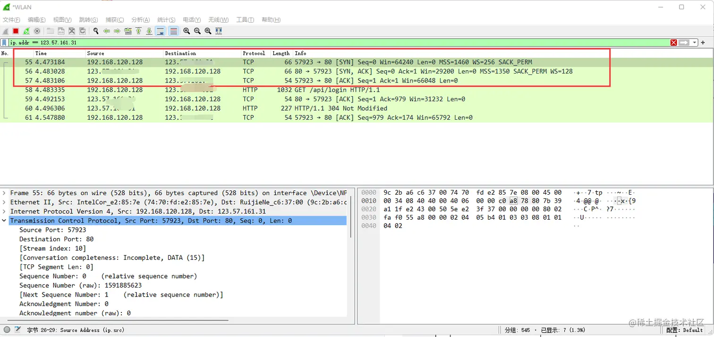

## 三次握手
1. 首先客户端会发送SYN报文跟服务端进行连接，并且会携带一个seq序列号(随机生成的)，客户端下次发送数据的序列号会进行+1处理。
2. 服务端收到客户端连接请求报文之后，服务端会携带ACK确认号表示之前的SYN收到了，并且会携带一个对应服务端的seq序列号，还会有一个小写的ack(客户端的seq + 1)向客户端发送报文。
3. 客户端收到服务端的响应报文之后，客户端会携带ACK确认号表示之前的SYN收到了，并且还会携带seq(这里的seq会通过算法计算出来是否跟服务端的ack值相等)和一个新的ack(服务端的seq值+1)向服务端发送报文。

### 为什么需要三次，两次不行
- 需要三次握手才能确认双方的接收与发送能力是否正常。
- 第一次握手：客户端发送网络包，服务端收到了。这样服务端就能得出结论：客户端的发送能力、服务端的接收能力是正常的。
- 第二次握手：服务端发包，客户端收到了。这样客户端就能得出结论：服务端的接收、发送能力，客户端的接收、发送能力是正常的。不过此时服务器并不能确认客户端的接收能力是否正常。
- 第三次握手：客户端发包，服务端收到了。这样服务端就能得出结论：客户端的接收、发送能力正常，服务器自己的发送、接收能力也正常。