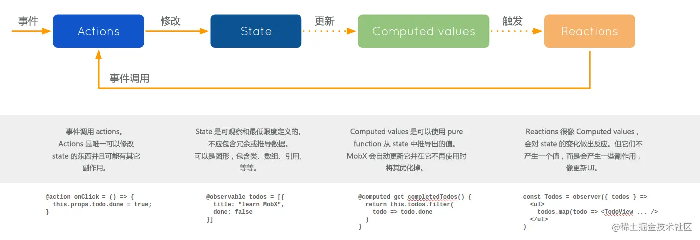

## redux与mobx对比
- 两个状态库的关键词，redux：不可变值；mobx：可观察的。
- 都解决了状态管理中状态混乱，传递不便捷，无法有效同步状态的问题。
### 数据流
- redux

- mobx

### 设计思想
- redux
  - 基于单向数据流和纯函数的理念，遵循严格的单一数据源原则。
  - 采用action - reducer的模式，action描述状态的变化，reducer是一个纯函数，根据旧状态和action计算并返回新状态。这种模式使得状态变化可预测，便于调试和维护。
- mobx
  - 基于响应式编程思想，它将状态视为可观察对象，当这些可观察对象的值发生变化时，依赖于它们的组件或计算值会自动更新。
  - 强调状态的自由流动和最小化样板代码，允许在任何地方修改状态，只要遵循mobx的响应式规则。
### 性能
- redux
  - 由于每次状态变化都需要创建新的状态对象，在处理大型数据结构时频繁创建新对象会消耗大量的内存和CPU资源。
  - 当组件映射的状态不够精细时可能会导致性能问题。通过使用React-Redux的connect高阶组件或Hooks精准映射使用的state，可以优化组件的渲染，减少不必要的重新渲染。
- mobx
  - 可以直接在任何地方修改状态，无需创建新的状态对象。
  - 采用响应式更新机制，只有依赖于发生变化的可观察对象的组件才会重新渲染，因此在性能上通常表现较好，尤其是在处理复杂的状态更新时。

| redux | mobx |
| --- | --- |
| 需要中间件处理异步 | 可以直接处理异步 |
| 需要保证数据不可变 | 数据是响应式的，可以直接修改数据 |
| 状态变化是可预测的，可以记录所有的action，调试相对容易 | 调试相对复杂，因为状态的变化可以在任何地方发生，难以追踪状态的变化路径 |
| 有严格的工作流程，需要写一些模板代码 | 无模板代码，非常简洁 |
| 约束强，适合大型多人协作开发 | 适合简单规模不大的应用 |

### mobx采用响应式更新机制，只有使用发生变化的可观察对象的组件才会重新渲染。
> 在Age组件中更新store.info.detail.age时，只有Age组件会重新渲染，Sex组件不会重新渲染。因为Sex组件只使用了store.info.detail.sex，没有使用store.info.detail.age。

- store.js
```
import { makeAutoObservable, action } from "mobx";

class Store {
  info = {
    name: "dyx",
    detail: {
      age: 28,
      sex: "man",
    },
  };

  constructor() {
    makeAutoObservable(this);
  }
  @action changeAge = (age) => {
    this.info.detail.age = age;
  };
}

export default new Store();
```
- app.js
```
import React from "react";
import { inject, observer } from "mobx-react";
import Age from "./age";
import Sex from "./sex";

function App(props) {
  return (
    <div>
      {props.name}
      <Age />
      <Sex />
    </div>
  );
}

const mapStoreToProps = ({ store }) => {
  return {
    name: store.info.name,
  };
};

export default inject(mapStoreToProps)(observer(App));
```
- age.js
```
import React from "react";
import { inject, observer } from "mobx-react";

function Age(props) {
  console.log("age", "dyx");
  return (
    <div>
      {props.detail.age}
      <button onClick={() => props.changeAge(props.detail.age + 1)}>+1</button>
    </div>
  );
}

const mapStoreToProps = ({ store }) => {
  return {
    detail: store.info.detail,
    changeAge: store.changeAge,
  };
};

export default inject(mapStoreToProps)(observer(Age));
```
- sex.js
```
import React from "react";
import { inject, observer } from "mobx-react";

function Sex(props) {
  console.log("sex", "dyx");
  return <div>{props.detail.sex}</div>;
}

const mapStoreToProps = ({ store }) => {
  return {
    detail: store.info.detail,
  };
};

export default inject(mapStoreToProps)(observer(Sex));
```
### redux根据映射到组件的状态是否变化，决定是否重新渲染组件，即使组件没有使用到该状态，也会重新渲染。
> 在Age组件中更新store.info.detail.age时，Age组件和Sex组件都会重新渲染，因为两个组件都映射了detail状态，如果将Sex组件精细的只映射store.info.detail.sex时，Sex组件不会重新渲染。

- store.js
```
import { createStore } from "redux";

const initialState = {
  info: {
    name: "dyx",
    detail: {
      age: 28,
      sex: "man",
    },
  },
};

const reducers = (state = initialState, action) => {
  const payload = action.payload;
  switch (action.type) {
    case "changeAge":
      return {
        ...state,
        info: {
          ...state.info,
          detail: {
            ...state.info.detail,
            age: payload,
          },
        },
      };
    default:
      return state;
  }
};

export const store = createStore(reducers);
```
- app.js
```
import React from "react";
import { connect } from "react-redux";
import Age from "./age";
import Sex from "./sex";

function App(props) {
  return (
    <div>
      {props.name}
      <Age />
      <Sex />
    </div>
  );
}

export default connect((state) => ({
  name: state.info.name,
}))(App);
```
- age.js
```
import React from "react";
import { connect } from "react-redux";

function Age(props) {
  console.log("age", "dyx");
  return (
    <div>
      {props.detail.age}
      <button
        onClick={() => {
          props.dispatch({
            type: "changeAge",
            payload: props.detail.age + 1,
          });
        }}
      >
        +1
      </button>
    </div>
  );
}

export default connect((state) => ({
  detail: state.info.detail,
}))(Age);
```
- sex.js
```
import React from "react";
import { connect } from "react-redux";

function Sex(props) {
  console.log("sex", "dyx");
  return (
    <div>
      {props.detail.sex}
    </div>
  );
}

export default connect((state) => ({
  detail: state.info.detail,
}))(Sex);
```