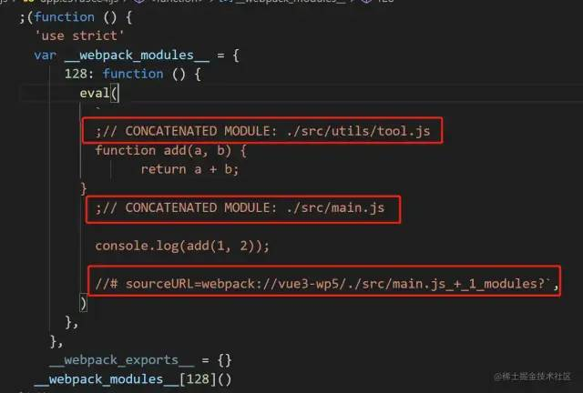
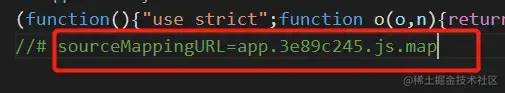
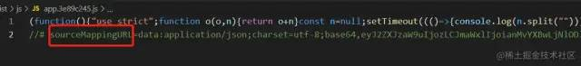
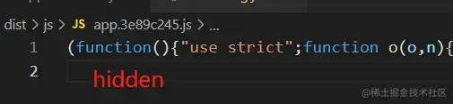
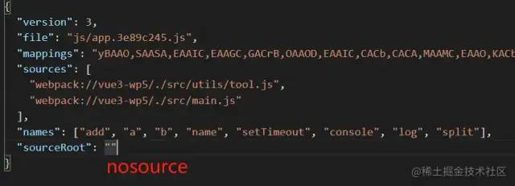
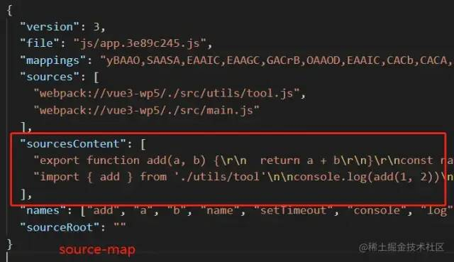

## webpack中使用sourcemap
> webpack中通过设置devtool的选项配置使用sourcemap功能，值类型包括以下类型的组合。

- none(默认值)
  1. 不会生成map文件。
- eval
  1. 会生成被eval函数包裹的模块内容，并在其中通过注释来注明是源文件位置，其中的sourceUrl是用来来指定文件名。
  2. 优点是快因为不用生成.map文件，并且运行时代码映射到开发时代码只需要提供对应的源文件地址。
  3. 缺点就是包含映射信息少，并且eval函数因为安全性问题也是不建议使用的。

- source-map
  1. 会生成单独的.map文件包含version、file、sources、sourcesContent、names、mappings、sourceRoot等信息，需要进行mapping和编码工作。
  2. 优点就是拥有单独的.map文件，使得运行时代码体积不会过大，并且能够提供详细的信息，包含文件名、行、列等信息。
  3. 缺点就是慢，因为需要额外生成.map文件，并且随着模块内容的增多整体速度就越慢。

- cheap
  1. 和source-map的方式不同，cheap只会映射到源码的行信息，即它不会生成源码的列信息，也不包含loader的sourcemap，因此相对来说会比source-map的方式更快。
  2. 优点就是速度更快，只映射到源码的行信息的原因是：通常在进行错误定位时，大多数情况下只需要关注到行就可以知道错误原因，而很少会关注到列，因此列信息其实不是必要性的。
  3. 缺点就是映射信息会不够精确，因为一个文件可能会经过不同loader的处理，而它又不生成loader相关的sourcemap，自然会导致最终产物的信息不够精确。
- module
  1. module的方式生成的sourcemap就会包含和loader相关的sourcemap信息。
  2. 需要loader相关的sourcemap信息的原因在于当一个文件被多个laoder依次进行转换处理后，其内容会发生不同的变化，就会使得我们无法去调试最初始的代码内容。
- inline
  1. 会将原本生成的.map文件的内容作为DataURL(base64 形式)嵌入bundle文件中，不单独生成.map文件。

- hidden
  1. 会生成单独的.map文件，但是相比于source-map的形式，其会在对应的bundle文件中隐藏sourceMappingURL的路径。

- nosources
  1. 在source-map生成的.map文件中的sourceContent存储的是源码内容，这样的好处是既可以根据文件路径来映射，也可以根据这部分内容来映射，source-map提供了双重保险，但也增加了.map文件体积。
  2. nosources则是在能够保证文件路径可以准确建立映射的情况下，就可以把sourceContent的内容给去除掉，使得.map文件体积能够更小一些。

### 生产环境建议使用
> 生产环境下为了防止别人获取源代码，通常不会将sourcemap文件上传到静态资源服务器，而是上传到内部服务器上。当用户触发js错误时，通过前端监控系统或者其它手段收集到出错信息，然后根据内部服务器的sourcemap结合出错信息，找到出错的源代码位置。

- source-map
  1. 生成的map文件包含完整的原始代码，但是打包会很慢。打包后的js最后一行是map文件地址的注释。
  2. 生产环境报错会正确提示错误的行数、列数，会显示源代码。source面板会显示源代码目录结构和代码。
- nosources-source-map
  1. 生成的map文件不包含源码。
  2. 生产环境报错会正确提示错误的行数。source面板会显示源代码目录结构和文件名，不会显示代码。
- hidden-source-map
  1. 与source-map相同，也会生成map文件，但是打包后的js最后没有map文件地址的引用。
  2. 生产环境报错不会提示错误的行数、列数，source面板不会显示源代码目录结构和代码。