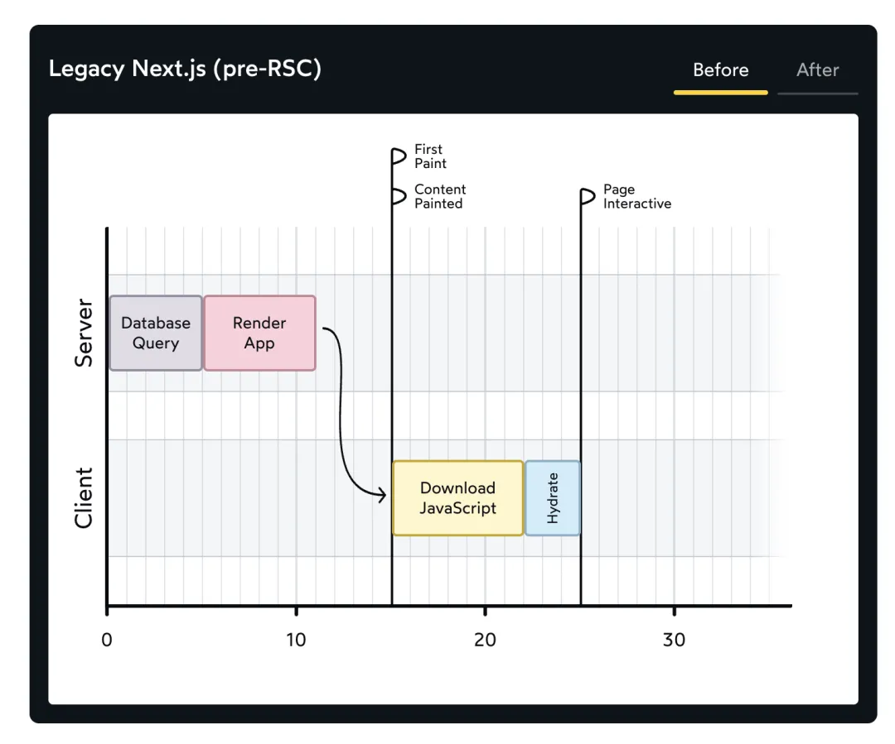
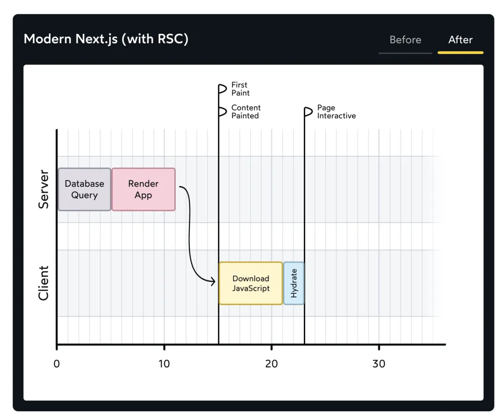

## React服务端渲染
- 服务器不再发送空的HTML文件，而是发送应用程序渲染生成的实际HTML，用户会收到一个完整的HTML文档。
- 这个HTML文件仍然会包含script标签，因为仍然需要React在客户端上运行，以处理任何交互(事件绑定等)。但是React在浏览器端以不同的方式工作：不再从头开始创建所有的DOM节点，而是采用现有的HTML。这个过程称为“hydration”(水合)。
- 一旦JS资源被下载，React将迅速遍历整个应用程序，构建UI的虚拟草图，并将其“贴合”到真实的DOM上，附加事件处理程序，触发任何效果等等。
初始的页面html结构由服务端生成并返回，后续的事件操作交互等交给常规打包完成的js实现。
- hydration(水合)就像用交互性和事件处理程序的“水”来滋润“干燥”的HTML。
- 服务器端渲染(SSR)的要点：服务器生成初始的HTML，这样用户在下载和解析JS资源的过程中就不必盯着空白的页面。后续的事件操作交互等交给常规的JS(客户端React)实现。
### React客户端渲染
- 客户端接收到一个HTML文件，这个文件没有任何内容，但包含一个或多个script标签。
- JS资源被下载并解析后React应用程序将启动，创建一堆DOM节点并填充UI。

### 服务端静态渲染
- 服务器进行初始渲染，数据请求相关逻辑在客户端完成。

### 服务端动态渲染
- 服务器端进行数据请求，服务器直接发送完全填充数据DOM结构的HTML文件。

### React Server Components(React服务器组件)
- 专门在服务器上渲染，它们的代码不包含在JS资源中，因此它们不会进行水合处理或重新渲染。
- 不能使用状态，因为状态可以更改，但服务器组件不能重新渲染。也不能使用效果，因为效果只在渲染之后在客户端上运行，而服务器组件永远不会到达客户端。
- 支持异步，支持直接在渲染中进行副作用操作。
- React Server Components不是服务器端渲染的替代品，可以将其视为和服务端渲染完美契合的独立拼图。
```
import db from 'imaginary-db';

async function Homepage() {
  const link = db.connect('localhost', 'root', 'passw0rd');
  const data = await db.query(link, 'SELECT * FROM products');

  return (
    <>
      <h1>Trending Products</h1>
      {data.map((item) => (
        <article key={item.id}>
          <h2>{item.title}</h2>
          <p>{item.description}</p>
        </article>
      ))}
    </>
  );
}

export default Homepage;
```
### React Server Components目前只能搭配Next.js使用
- 在Next.js的React Server Components模式下默认情况下所有组件都是服务器组件。
- 当需要使用状态或者添加交互时可以通过use client关键字表明此文件中的组件是客户端组件，它们应该包含在JS资源中，以便它们可以在客户端重新渲染。
- 使用use client关键字声明为客户端组件之后，这个客户端组件只能导入其它客户端组件，导入的组件即使没有声明use client关键字，也会隐式将导入的组件转化为客户端组件。
- 为了防止一个组件声明为客户端组件之后该组件导入的所有组件都将隐式的转化为客户端组件的问题，可以将需要使用客户端组件相关功能的逻辑单独提取为一个组件，并将该组件移动到独有的文件中，从而减少使用use client关键字的影响范围。
- 声明为客户端组件之后隐式将导入的组件转化为客户端组件的特性只在文件/模块级别工作，不会因为组件层级关系而隐式转化，服务端组件是客户端组件(文件中没有导入服务端组件)的子组件时不会隐式将子组件转化为客户端组件。
### React Server Components的优势
- 性能更好，服务器组件不包含在JS资源中，这减少了需要下载的JavaScript数量，以及需要hydration(水合)的组件数量。

