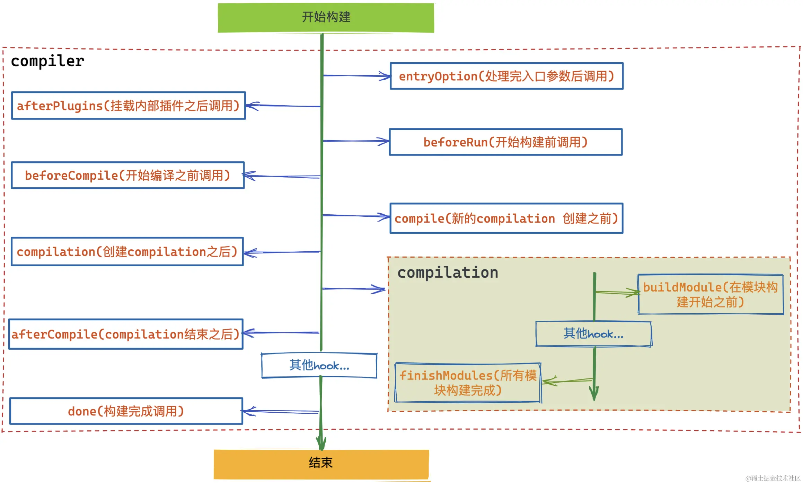

## [plugin](https://juejin.cn/post/7160467329334607908)
- Webpack Plugin向第三方开发者提供了Webpack引擎中完整的能力。
- 使用阶段式的构建回调，开发者可以在Webpack构建流程中引入自定义的行为，至于在哪个阶段插入或者做什么事情都可以通过Webpack Plugin来完成。
### tapable
- tapable是一个类似于Node.js中的EventEmitter的库，但它更专注于自定义事件的触发和处理。通过tapable可以注册自定义事件，然后在适当的时机去触发执行。
- Webpack本质上是一种事件流的机制，它的工作流程就是将各个插件串联起来，比如：
  - 在打包前需要处理用户传过来的参数，判断是采用单入口还是多入口打包，就是通过EntryOptionPlugin插件来做的。
  - 在打包过程中，需要知道采用哪种读文件的方式就是通过NodeEnvironmentPlugin插件来做的。
  - 在打包完成后，需要先清空dist文件夹，就是通过CleanWebpackPlugin插件来完成的。
- 实现上述机制的核心就是tapable。Webpack内部通过tapable会提前定义好一系列不同阶段的hook，然后在固定的时间点去执行（触发call函数）。而插件要做的就是通过tap函数注册自定义事件，从而让其控制在Webapack事件流上运行。
- tapable通过tap函数注册监听函数，然后通过call函数按顺序执行之前注册的函数。
```
const { SyncHook } = require("tapable"); // 这是一个同步钩子

// 第一步：实例化钩子函数，可以在这里定义形参
const syncHook = new SyncHook(["author"]);

// 第二步：注册事件1
syncHook.tap("监听器1", (name) => {
  console.log("监听器1:", name);
});

// 第二步：注册事件2
syncHook.tap("监听器2", (name) => {
  console.log("监听器2", name);
});

// 第三步：触发事件
syncHook.call("不要秃头啊");
```
### Compiler和Compilation 
- compiler对象代表了完整的webpack生命周期。这个对象在启动Webpack时被一次性建立，并配置好所有可操作的设置，包括options，loader和plugin。当在 Webpack环境中应用一个插件时，插件将收到此compiler对象的引用，可以使用它来访问Webpack的主环境。
- compilation对象代表了一次资源版本构建，主要负责对模块资源的处理。当运行Webpack开发环境中间件（webpack-dev-server）时，每当检测到一个文件变化，就会创建一个新的 compilation，从而生成一组新的编译资源。一个compilation对象表现了当前的模块资源、编译生成资源、变化的文件、以及被跟踪依赖的状态信息。compilation对象也提供了很多关键时机的回调，以供插件做自定义处理时选择使用。
- compilation只是compiler中某一阶段的hook，主要负责对模块资源的处理，只不过它的工作更加细化，在它内部还有一些子hook。

- 这么处理是为了解耦，当启动Webpack的watch模式时文件模块发生变化会重新进行编译，这个时候并不需要每次都重新创建compiler实例，只需要重新创建一个compilation来记录编译信息即可。
### 编写plugin
- Webpack Plugin其实就是一个普通的函数，在该函数中需要定制一个apply方法。当Webpack内部进行插件挂载时会执行apply函数。可以在apply方法中订阅各种生命周期钩子，当到达对应的时间点时就会执行。
- 在构建完成后打印日志。
```
// plugins/demo-plugin.js
class DemoPlugin {
  apply(compiler) {
    // 在done（构建完成后执行）这个hook上注册自定义事件
    compiler.hooks.done.tap("DemoPlugin", () => {
      console.log("DemoPlugin：编译结束了");
    });
  }
}

module.exports = DemoPlugin;


// webpack.config.js
const DemoPlugin = require("./plugins/demo-plugin");

module.exports = {
  mode: "development",
  entry: "./src/index.js",
  devtool: false,
  plugins: [new DemoPlugin()],
};
```