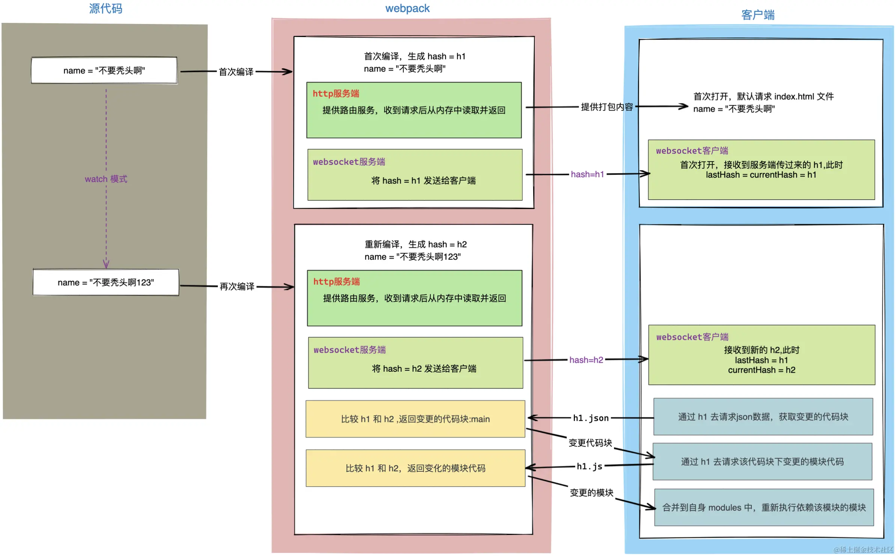

## [热更新](https://juejin.cn/post/7176963906844246074)
- 热更新可以在不刷新整个页面的情况下更新页面中的部分内容，从而提高开发效率，优化开发体验。
- 在引入热更新之前，应用的加载、更新都是一种页面级别的操作，即使只有单个代码文件发生变更，都需要刷新整个页面，才能将最新代码映射到浏览器上，这会丢失之前在页面执行过的所有交互与状态。而引入热更新后，虽然无法覆盖所有场景，但大多数小改动都可以通过模块热替换方式更新到页面上，从而确保连续、顺畅的开发调试体验，极大提升开发效率。
### webpack-dev-server
- webpack-dev-server是热更新实现的核心包。
- 当运行webpack serve后，webpack-dev-server会先往客户端代码中添加了两个文件，这两个文件的目的：
  1. websocket相关的代码，用来跟服务端通信。
  2. 客户端接收到最新代码后，更新代码。
- 接着还会启动两个服务：
  1. 一个本地HTTP服务：这个本地服务会给我们提供编译之后的结果，之后浏览器通过端口请求时，就会请求本地服务中编译之后的内容。
  2. 一个websocket双向通信服务器：如果有新的模块发生变化，编译成功会以消息的方式通知客户端，让客户端来请求最新代码，并进行客户端的热更新。
- 然后会以watch模式开始编译，每次编译结束后会生成一个唯一的hash值。
### 首次启动
- 在初次编译完成（启动项目）后，webpack内部会生成一个hash = h1，并将hash = h1通过websocket的方式通知给客户端，客户端上有两个变量lastHash：上一次接收到的hash、currentHash：这一次接收到的hash。
- 如果是第一次接收到hash值，代表是第一次连接，则lastHash = currentHash = hash。
### 二次编译
- 如果源代码发生变化，webpack对源文件重新进行编译，在编译完成后生成hash = h2，并将hash = h2发送给客户端，客户端接收到消息后，修改自身的变量：lastHash = h1，currentHash = h2。
- 接着客户端通过lastHash = h1向服务端请求json数据，目的是为了获得变更的代码块。
- 服务端接收到请求后，将传过来的h1和自身最新的hash = h2进行对比，找出变更的代码块后返回给客户端。
- 客户端在收到响应后，知道了哪些代码块发生了变化，接着会继续通过lastHash = h1向服务端去请求变更代码块中变动的模块代码。
- 服务端接收到请求后，将传过来的h1和自身最新的hash = h2再次进行对比，找出具体变更的模块代码后返回给客户端。
- 最后客户端拿到了变更模块的代码，重新去执行依赖该模块的模块达到更新的目的。

### 为什么客户端会有两个hash值
- 这么设计的用意是服务端不知道现在客户端的hash是多少，比如多窗口的场景连接了多个客户端，所以需要客户端将上一次的hash返回给服务端，服务端通过比较后返回变更的信息。
### 每次文件改变都重新编译，性能跟得上吗
- 为了提升性能，webpack-dev-server使用了memfs库（Webpack官方自己写的），这样每次打包之后的结果并不会进行输出（把文件写入到硬盘上会耗费很长的时间），而是将打包后的文件保留在内存中，以此来提升性能。
### watch模式
- 使用监控模式开始启动webpack编译，在webpack的watch模式下，文件系统中某一个文件发生修改，webpack监听到文件变化，根据配置文件对模块重新编译打包，每次编译都会产生一个唯一的hash值。
### 代码块（chunk）和模块（module）
- chunk就是若干module打成的包，一个chunk包括多个module，一般来说最终会形成一个文件。而module就是一个个代码模块。

