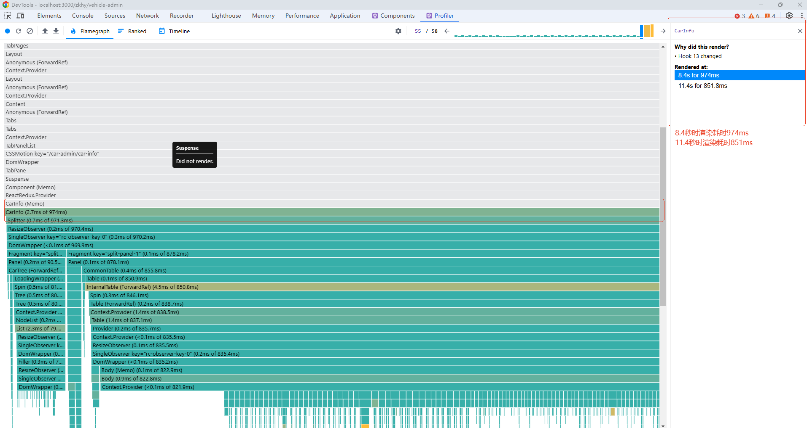

## [React Profiler](https://juejin.cn/post/7008337341634854942)
- React Developer Tools提供的Profiler可以直观的帮助我们找出React项目中的性能瓶颈，可以从浏览器扩展中安装使用。
- Profiler主要测量和记录React组件渲染阶段的性能数据，而不是提交阶段的性能数据。
### 面板基本功能
- 顶部按钮：开始/结束、重置并开始、清除信息。
- 图表显示类型：火焰图、排序图、时间线。
- 设置按钮：
  - General: Highlight updates when components render. 高亮发生更新的组件。
  - Profiler: Record each component rendered while profiling. 记录组件更新的原因。
### Commit information
> 点击更新柱状图(不选择某个组件)显示右侧Commit information。

- Committed at表示相对于本次record的时间，可以忽略。
- Durations中的Render表示本次更新耗时(对应react的Render阶段，生成新的虚拟DOM)，重点关注指标。

### 在火焰图中选择某个组件时右侧显示的组件信息
- Why did this render? 表示组件渲染的原因，state/props变化、hooks变化等原因。
- Rendered at 表示组件在记录时间段内所有的渲染信息。

