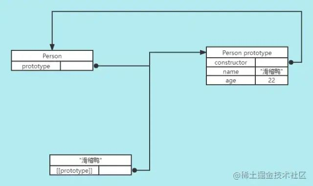
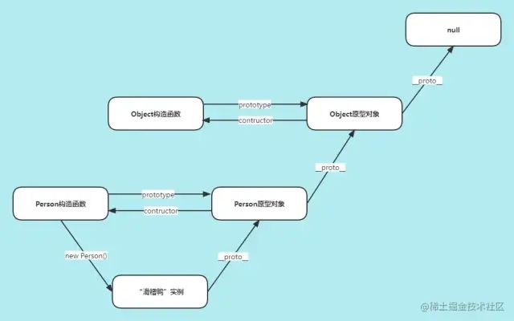
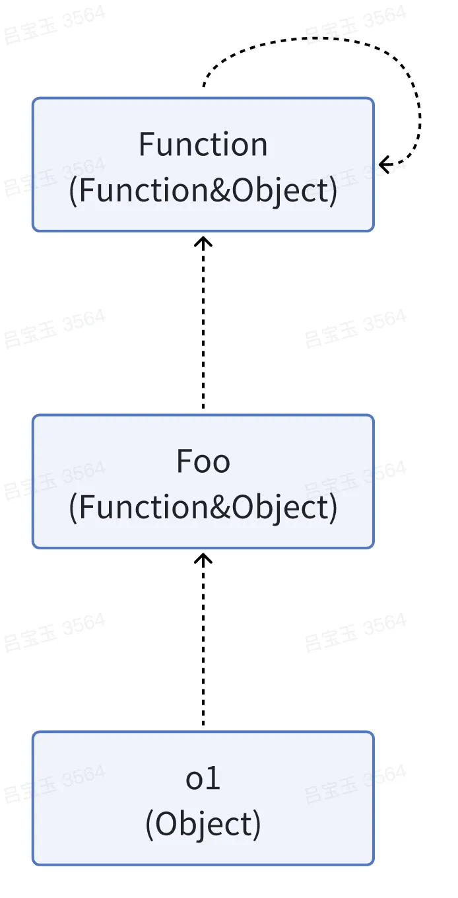
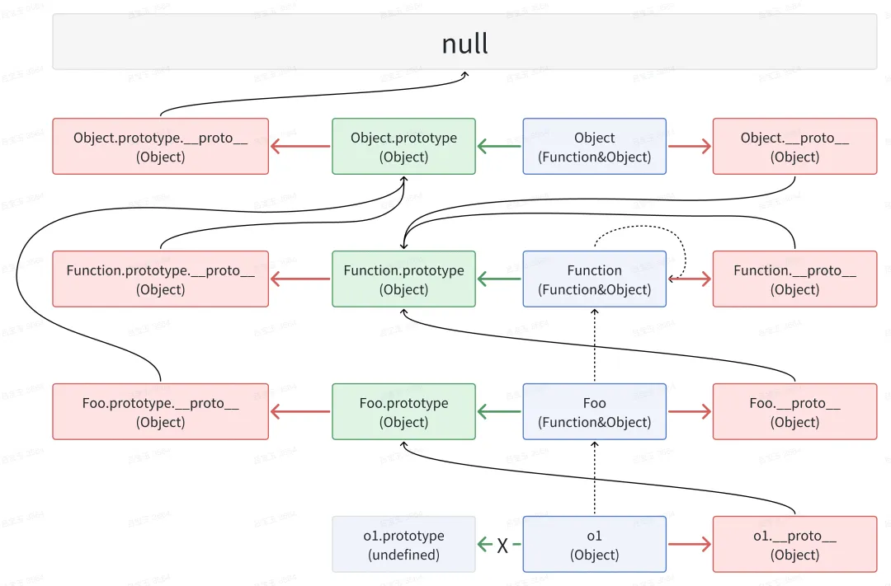

## 原型原型链
### 普通对象与函数对象
- JavaScript中对象分为普通对象和函数对象。通过new Function()创建的对象都是函数对象，其它的都是普通对象。
- 每个对象都有`__proto__`属性，但只有函数对象才有prototype属性。
- 所有函数对象的`__proto__`都指向Function.prototype，它是一个空函数。所有函数对象都继承了Function.prototype的属性及方法，如length、call、apply、bind。
### 原型对象 prototype
- 每个函数对象都会有一个prototype属性，这个属性值是一个对象，这个对象就是通过调用构造函数创建的对象实例的原型。
- 使用原型对象的好处是，在它上面定义的属性和方法都可以被实例共享。


### 原型 `__proto__`
- 所有非内置对象都拥有独有属性`__proto__`，对象的`__proto__`属性指向创建它的构造函数的原型对象。
- 例如对象dyx有一个`__proto__`属性，创建它的构造函数是Person，构造函数的原型对象是Person.prototype，所以`dyx.__proto__ === Person.prototype`。
- 内置对象如：Function、Date、Array、Object、Math、JSON等。
### 原型链
- 如果实例的原型是另一个构造函数的实例，于是该实例的原型本身又有一个内部指针(`__proto__`)指向另一个原型，相应的另一个原型也有一个内部指针(`__proto__`)指向另一个原型。这样实例和原型之间形成了一条长长的链条，这就是原型链。
- 所有函数对象的原型对象的`__proto__`都会指向内置的Object.prototype，而Object的原型对象的`__proto__`指向null。也就是说所有的普通对象都源于Object.prototype，它包含javascript中许多通用的功能。
- 每个对象都有一个私有属性`__proto__`指向另一个名为原型的对象。原型对象也有一个自己的原型，层层向上直到一个对象的原型为null。根据定义null没有原型，并作为这个原型链中的最后一个环节。
- 对象通过`__proto__`属性指向其构造函数的原型对象，进而通过原型对象的`__proto__`属性指向更高层级的原型对象，最终指向null而停止所形成的链条称为原型链。



### [构造函数](https://mp.weixin.qq.com/s/BtA5C_1DKpaztM6GYRakPg)
- 所有函数对象的原型对象的构造函数均指向其自身。
- 由于所有函数对象的原型对象的构造函数均为其自身，则如若`Foo.prototype.__proto__`指向其构造函数的prototype，即`Foo.prototype.__proto__`指向Foo.prototype，那么原型链的查找将进入无限循环。为了避免这个问题，则将所有函数对象的原型对象的`__proto__`均指向Object.prototype。
```
function Foo() {};
const o1 = new Foo();

o1.constructor === Foo // true
Foo.constructor === Function // true
Function.constructor === Function // true
```

### 原型对象、原型、构造函数的关系
- 每个构造函数都有一个原型对象(实例的原型)，原型对象有一个constructor属性指向构造函数。
- 构造函数构造出来的实例有一个内部指针即原型(在chrome、firefox、safari浏览器环境中这个指针就是`__proto__`)指向该构造函数的原型对象。
- 构造函数构造出来的实例的constructor属性指向该构造函数。
```
1. 创建一个空的构造函数Person。
2. 创建一个Person的实例dyx，dyx实例本身是没有挂载任何属性和方法的，但是它有一个`__proto__`内置属性，这个属性是个对象，里面有name、age属性和getName函数。
3. Person.prototype和dyx的`__proto__`都指向同一个对象，这个对象对于Person构造函数而言叫做原型对象，对于dyx实例而言叫做原型。
4. 实例dyx的constructor属性指向Person构造函数。


// Person构造函数
function Person() {}

// 在Person的原型对象上挂载属性和方法
Person.prototype.name = 'dyx';
Person.prototype.age = 26;
Person.prototype.getName = function() {
  return this.name;
}

const dyx = new Person();
console.log(dyx.name) // 'dyx'
console.log(dyx.getName()); // 'dyx'

console.log(Person.prototype.constructor === Person); // true
console.log(dyx.__proto__ === Person.prototype); // true
console.log(dyx.constructor === Person); // true
```



