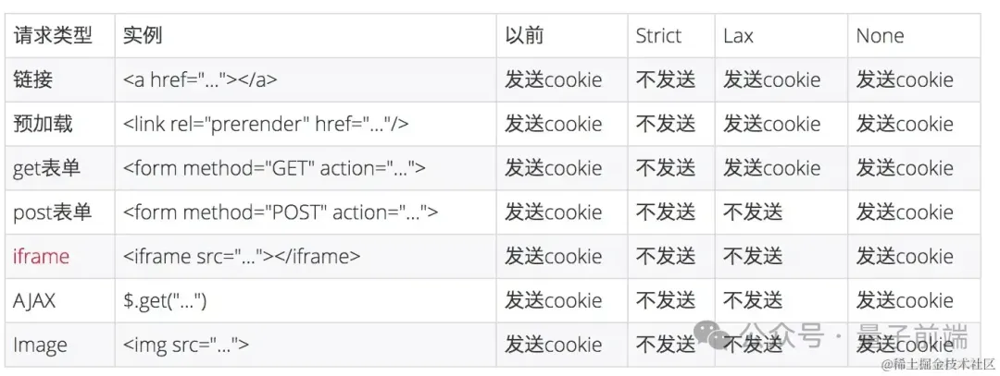

## Cookie
- Cookie最开始被设计出来其实并不是来做本地存储的，而是为了弥补HTTP在状态管理上的不足。HTTP协议是一个无状态协议，客户端向服务器发请求，服务端无法识别客户端身份。利用Cookie向同一个域名下发送请求，都会携带相同的Cookie，服务器拿到Cookie进行解析便能拿到客户端的状态。
- 服务端可以通过响应头中的Set-Cookie字段来对客户端写入Cookie。
- Cookie都是name=value的结构在浏览器中存储，name和value都为字符串。
### 服务端设置Cookie，后续请求携带Cookie的流程
1. 在首次访问网站时，浏览器发送请求中并未携带Cookie。
2. 浏览器看到请求中未携带Cookie，在HTTP的响应头中加入Set-Cookie。
3. 浏览器收到Set-Cookie后，会将Cookie保存下来。
4. 之后该网站的请求，HTTP请求头就会携带Cookie(浏览器默认行为)。
### Cookie配置属性
- Name：Cookie的名称
- Value：对应名称的值
- Domain：Cookie生效的域名，只能设置范围小于等于自己的域名范围。没有指定时默认值为当前文档访问地址中的主机部分(不包含子域名)
- Path：Cookie生效的路径，只有当路径匹配时才会向服务器发送Cookie。设置“/”表示此域下所有路径都可以携带cookie。
- Expires：过期时间，过了这个时间后Cookie失效
- Max-Age：生效时间，表示Cookie在多长时间后失效，单位为秒
- Size：Cookie的长度，为name和value的长度和
- HttpOnly：禁止通过JavaScript访问Cookie(防止跨站脚本攻击XSS)
- Secure：只在HTTPS协议的情况下才会将Cookie传到服务端
- SameSite：是否允许跨站请求时发送Cookie
- Priority：优先级，Cookie的大小一般为4KB，当超出这个范围时会移除旧的Cookie，删除时按照优先级由低到高删除。
- Partitioned：第三方Cookie分区
### Cookie生命周期
- 如果没有指定Expires或Max-Age属性默认值是Session，即它只在本次对话存在，一旦用户关闭浏览器，浏览器就不会再保留这个Cookie。
- 如果同时指定了Expires和Max-Age，那么Max-Age的值将优先生效。
#### Session
- 这里的Session并不是存储在服务端的Session，而是指浏览器会话。
- 如果Cookie的有效期为Session，一般关闭会话时Cookie便会失效。而一些浏览器重启时也会将会话恢复，此时Cookie并不会失效。
#### Expires
- Expires表示过期时间，是一个确定的日期时间，例如Expires=Wed, 21 Oct 2015 07:28:00 GMT。当浏览器端本地的当前时间超过这个时间时Cookie便会失效。
#### Max-Age
- Max-Age表示Cookie的存活时间，以秒作为单位，例如Max-Age=3000。当获取到该Cookie后开始倒计时，3000秒之后便失效。
- 当Max-Age < 0时表示该Cookie只是一个会话性Cookie。当Max-Age = 0时会立即删除这个Cookie。
### Cookie作用范围
#### Domain
- Domain用来设置Cookie作用的域名，即Cookie在哪个网站生效。
- 默认情况下生效的域名为当前访问的域名。例如我们在dyx.com设置的Cookie，就只能限制在该网站内使用。
#### 多级域名
- 如果访问的网站有多级域名，则Cookie默认仅在访问的多级域名内生效。例如在a.dyx.com下设置的Cookie，就只在这个域名下生效。
- 如果希望在更大范围内生效，可以指定域名。如果在设置Cookie时同时设置了domain=dyx.com，则该Cookie可以在dyx.com下的任何域名内生效。比如：
  - dyx.com
  - a.dyx.com
  - b.dyx.com
  - c.d.dyx.com
#### Path
- 当希望Cookie仅仅在部分路径下生效，就可以使用Path进行限制，默认的Path=/，即在所有路径下生效。 
- 如果设置了path=/abc，则只在/abc路径下生效。比如：
  - dyx.com 不生效
  - dyx.com/abc 生效
  - dyx.com/abc/def 生效
  - dyx.com/qaz 不生效
  - dyx.com/qaz/abc 不生效
### 个数和大小限制
- 不同的浏览器允许的Cookie大小并不相同，通常的个数限制为: 20~50；总大小限制为: 4KB左右。
- 一个Cookie的大小可以在浏览器中查看Size属性得知，这个大小是key和value的和。
### HttpOnly
- 通常的Cookie在客户端是可以通过js脚本代码访问的。
- 如果设置了HttpOnly属性，则该Cookie在浏览器中无法通过js代码读取也无法写入。这样可以防止窃取Cookie信息，一般用来防止XSS攻击。
### Secure
- 只能通过HTTPS传输Cookie。
### Priority优先级
- 当Cookie的数量超过限制时，浏览器会清除一部分Cookie，低优先级的Cookie会优先被清除。
- Priority属性用来定义Cookie的优先级。
  - Low
  - Medium
  - High
### 跨站与SameSite设置
- SameSite是Cookie的跨站属性，也可以看做是“更高级”的作用范围设置。
#### 跨站与跨域
- web中任何请求都受到同源限制，Cookie在此基础上还会受到同站策略限制(samesite指定)。
- ajax跨域请求一般有两个问题。
  1. 请求能否发出去。
  2. Cookie能否携带上。
- 一般浏览器限制请求的内容是按照跨域来判断的，比如XHR和fetch。但是SameSite限制的并不是跨域而是跨站。
- 跨站是比跨域更宽松的一种限制。如果跨站那么肯定会跨域，但如果跨域不一定会跨站。
#### 跨站和跨域的主要区别
- 子域名不同时属于跨域不属于跨站。例如a.dyx.com与b.dyx.com。
- 端口不同时属于跨域不属于跨站。例如dyx.com:8000与dyx.com:9000。
- IP不同时(如果直接使用IP访问网站)属于跨域和跨站。
#### 请求分类
- 可能打开新页面或者改变当前页面的请求。例如：window.open()，`<a>`链接，form表单提交等。
- 不改变当前页面的请求。例如：`<script>、<css>、`等标签，fetch，XHR请求等。
- 这两类的主要区别是第一类请求直接把页面替换了或者打开了一个新的页面，即和原有的页面不属于同一个页面。而第二类请求依然在原页面上，仅仅是做一些内容上的更新。
- 请求分类与SameSite配置相关。
#### SameSite设置
- None：关闭SameSite属性，即不对跨站Cookie做限制。关闭的前提是设置了Secure，即Cookie只能在HTTPS下使用，否则关闭是无效的。
- Strict：禁止发送跨站Cookie。即不管是什么请求，如果我们请求的地址与所在的页面地址属于跨站，那么Strict的Cookie将不会被发送。
- Lax(默认值)：请求分类的第一种情况下可以发送跨站Cookie，即可能打开新页面或者改变当前页面的请求而且是个Get请求时可以发送。其它请求不允许发送。

### JavaScript中操作Cookie
- 设置Cookie
> 一次只能设置一个Cookie。但是可以同时对单个Cookie的多个属性进行设置，每个属性使用分隔符;

```
document.cookie = "name=dyx";
document.cookie = "name=dyx; doamin=dyx.com";
document.cookie = "name=dyx; doamin=dyx.com; path=/abc";
```
- 修改Cookie
> 修改Cookie相当于对其进行重新设置。

- 读取Cookie
> 读取到的是一个字符串，内容为该页面的所有Cookie，不同的Cookie用分隔符;分隔。只能读到key和value，其余的属性读不到。

```
document.cookie
// 读取到的值
"name=dyx; name1=douyaxing"
```
- 删除Cookie
> js中没有直接删除Cookie的方法。如果需要删除某个Cookie，需要重新设置该Cookie，将它的有效期直接设置为过期即可实现删除功能。

```
document.cookie = "name=dyx; max-age=-1";
```
### 相同域名下的不同端口的Cookie可以共享
### 跨域请求携带Cookie
- 网站a中使用ajax请求跨域访问网站b的接口。
- 网站b的服务端需要设置CORS，这样网站a的跨域请求才能够被正常处理。
  1. 设置响应头Access-Control-Allow-Credentials为true。
  2. Access-Control-Allow-Origin不能设置为*，必须是请求方的具体源。
- 网站a的请求参数中添加withCredentials=true属性，这样浏览器才会携带Cookie到网站b的服务端。
- ajax跨域请求无法携带SameSite=Lax的Cookie。
### 跨域无法携带Cookie VS 浏览器全面禁止第三方Cookie
- 目的不同：跨域请求默认不携带Cookie主要是出于安全考虑，防止跨站点请求伪造等攻击；禁止第三方Cookie主要是出于隐私保护考虑，防止用户跨网站被追踪。
- 操作层面不同：跨域Cookie的发送需要通过适当的服务器和客户端配置来实现；第三方Cookie的禁用是由浏览器控制，影响所有第三方来源的Cookie。
### Cookie相较于WebStorage的缺陷
- 容量缺陷：Cookie的体积上限只有4KB，只能用来存储少量的信息。
- 安全缺陷：Cookie在每次请求中都会被发送，如果不使用HTTPS并对其加密，其保存的信息很容易被窃取导致安全风险。
- 操作缺陷：Cookie的操作相较于WebStorage较为繁琐复杂。
### Cookie与Session的区别
- 存储位置不同：Cookie的数据信息存放在客户端浏览器上，Session的数据信息存放在服务器上。
- 存储容量不同：单个Cookie保存的数据<=4KB，一个站点最多保存20个Cookie，而对于Session来说并没有上限，但出于对服务器端的性能考虑，Session内不要存放过多的东西，并且设置Session删除机制。
- 存储方式不同：Cookie中只能保管ASCII字符串，并需要通过编码方式存储为Unicode字符或者二进制数据。Session中能够存储任何类型的数据，包括且不限于string，integer，list，map等。
- 隐私策略不同：Cookie对客户端是可见的，别有用心的人可以分析存放在本地的Cookie并进行Cookie欺骗，所以它是不安全的，而Session存储在服务器上，对客户端是不透明的，不存在敏感信息泄漏的风险。
- 有效期上不同：开发可以通过设置Cookie的属性，达到使Cookie长期有效的效果。Session依赖于名为JSESSIONID的Cookie，而Cookie JSESSIONID的过期时间默认为-1，只需关闭窗口该Session就会失效，因而Session不能达到长期有效的效果。
- 服务器压力不同：Cookie保管在客户端，不占用服务器资源。对于并发用户十分多的网站Cookie是很好的选择。Session是保管在服务器端的，每个用户都会产生一个Session。假如并发访问的用户十分多，会产生十分多的Session，耗费大量的内存。
- 跨域支持上不同：Cookie支持跨域名访问(二级域名是可以共享Cookie的)。Session不支持跨域名访问。